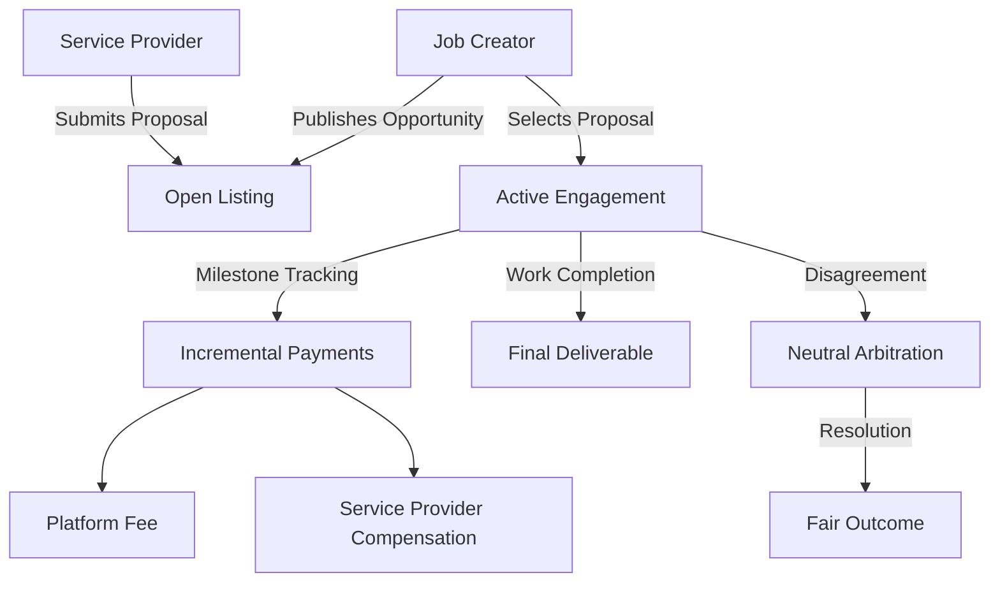

# Encode Marketplace Protocol

A decentralized blockchain-native platform for secure, transparent, and efficient job matching and remote work coordination. Built on Stacks, Encode eliminates traditional marketplace friction by leveraging smart contract technology.

## Overview

Encode Marketplace provides:
- Decentralized job posting and proposal mechanisms
- Secure escrow and milestone-based compensation
- Transparent dispute resolution
- Reputation tracking for participants
- Low platform fees (2.5%)

## Architecture



## Key Features

1. **Job Lifecycle Management**
   - Permissionless job creation
   - Proposal submission and selection
   - Milestone-based payment structures
   - Automatic fund escrow

2. **Economic Design**
   - Minimal platform fees
   - Transparent compensation mechanisms
   - Built-in reputation scoring
   - Cryptographically secured transactions

3. **Dispute Resolution**
   - Neutral arbitration process
   - Evidence-based decision making
   - Flexible resolution options

## Getting Started

### Requirements
- Stacks Wallet
- STX Tokens
- Web3 Compatibility

### Basic Interactions

**Create Job**
```clarity
(contract-call? .encode-marketplace create-job
    "Web3 Development Project"
    "Build decentralized application frontend"
    u5000   ;; Total Budget
    u1000   ;; Expiration Block
)
```

**Submit Proposal**
```clarity
(contract-call? .encode-marketplace submit-work-proposal
    u1      ;; Job ID
    "Comprehensive frontend implementation"
    u4500   ;; Proposed Compensation
    u950    ;; Proposed Timeline
)
```

## Security Principles

- Non-custodial fund management
- Cryptographic transaction verification
- Role-based access controls
- Transparent economic mechanisms

## Development

### Testing
```bash
clarinet test
```

### Deployment Considerations
- Supports STX ecosystem
- Minimal gas consumption
- Fully auditable transaction history

## Limitations
- STX token exclusive
- Fixed 2.5% platform fee
- Block-height dependent mechanics